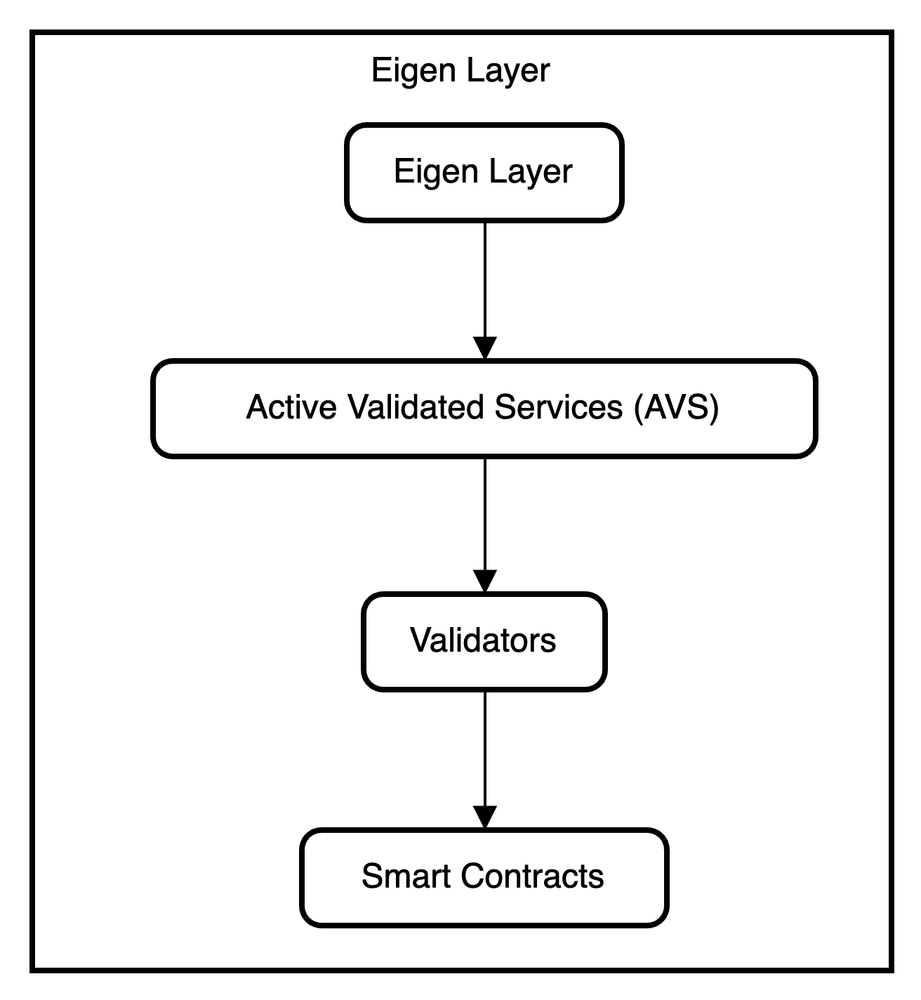

# Eigen Layer: Generating Additional Rewards

The Keystake Protocol introduces Eigen Layer, a cutting-edge technology that adds a new dimension to staking by enabling Ethereum stakers to validate actively validated services (AVS). This section provides an overview of Eigen Layer and its role in generating additional rewards for participants in the Keystake Protocol.

### Active Validated Services (AVS)

Active Validated Services (AVS) are software modules built on top of the Ethereum ecosystem that require validation by the stakers. AVS represent a diverse range of applications, smart contracts, or decentralized finance (DeFi) protocols that benefit from the validation process to enhance their security, reliability, and overall functionality.

The Eigen Layer enables Ethereum stakers to opt-in and participate in the validation of AVS. By actively validating these services, stakers contribute to the verification and maintenance of the Ethereum ecosystem, while unlocking additional rewards beyond the regular staking rewards.

### Restaking and Free-Market Governance

Eigen Layer introduces the concept of restaking, allowing stakers to reinvest their rewards into the validation of new AVS. This reinvestment process amplifies the potential for earning higher rewards over time. Stakers can choose to restake their earnings in specific AVS that align with their risk appetite and investment strategies.

Moreover, Eigen Layer embraces the principles of free-market governance. Validators have the freedom to select and validate the AVS of their choice based on their individual preferences, risk assessment, and belief in the potential of specific projects. This decentralized approach empowers validators to actively contribute to the growth and security of the Ethereum ecosystem while exercising their judgment in AVS selection.

### Yield Potential and Additional Rewards

By participating in the validation of AVS, stakers within the Keystake Protocol have the opportunity to earn additional rewards on top of their regular staking rewards. The yield potential for Eigen Layer is expected to surpass 10%, providing a compelling incentive for stakers to engage in AVS validation.

The additional rewards earned through Eigen Layer bolster the overall passive income generated by participants, enhancing the value proposition of the Keystake Protocol. Stakers can experience exponential growth in their rewards by continuously restaking and validating AVS, contributing to the security and prosperity of the Ethereum ecosystem.

### Security and Verification

Eigen Layer ensures the security and verification of AVS through the participation of validators within the Keystake Protocol. By employing a decentralized network of validators, Eigen Layer enhances the trustworthiness and integrity of the AVS being validated. Validators play a critical role in maintaining the high standards of security and reliability associated with the Keystake Protocol.

Furthermore, Eigen Layer is designed to work in conjunction with the Ethereum Network's validators and smart contracts. Validators within the Keystake Protocol collaborate with the Ethereum Network's validators to collectively contribute to the security and consensus mechanisms of the entire Ethereum ecosystem.

### Conclusion

Eigen Layer is a key component of the Keystake Protocol, enabling Ethereum stakers to go beyond traditional staking by validating actively validated services (AVS). By participating in AVS validation, stakers unlock additional rewards and contribute to the growth and security of the Ethereum ecosystem.

The innovative restaking mechanism and free-market governance principles of Eigen Layer provide stakers with opportunities for increased yields and active participation in shaping the future of the Ethereum ecosystem. With Eigen Layer, the Keystake Protocol offers an enhanced staking experience, facilitating not only passive income generation but also active contribution to the advancement of the Ethereum network.
